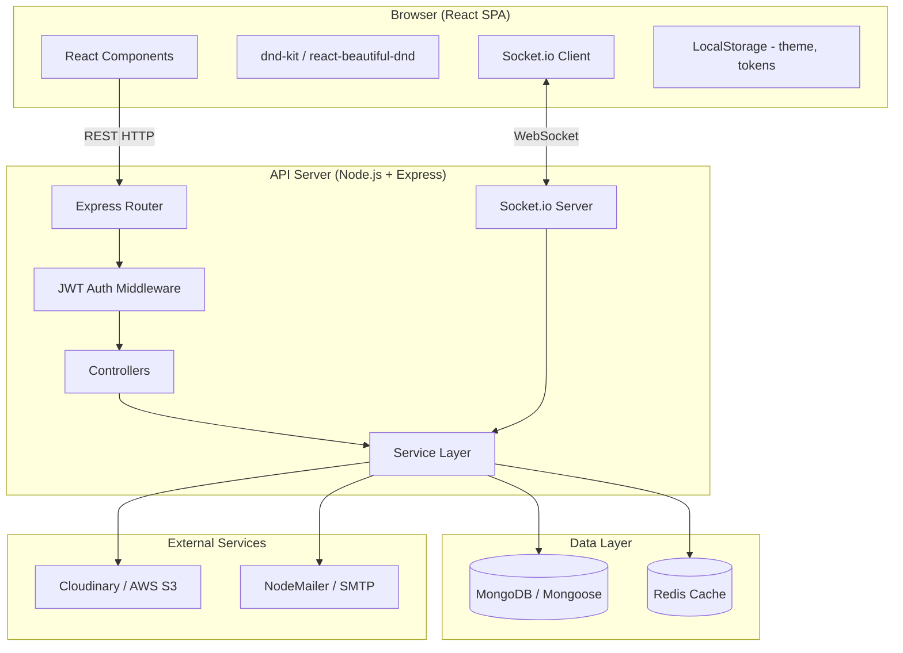

# Design Document: Advanced Trello-like Task Manager

## Overview

The Advanced Trello-like Task Manager is a full-stack collaborative project management application. It follows a client-server architecture with a React SPA frontend communicating with a Node.js/Express REST API backend, a MongoDB database, and a Socket.io layer for real-time push events. Redis provides a caching layer for expensive aggregation queries, and Cloudinary/AWS S3 handles binary file storage.

The system is designed around five core domains:
- **Identity & Access** — registration, JWT authentication, refresh token rotation, role-based authorization
- **Board Workspace** — boards, lists, tasks, drag-and-drop reordering
- **Collaboration** — comments, activity logs, real-time Socket.io events, email invitations
- **Productivity** — due-date tracking, overdue detection, smart dashboard analytics
- **Content** — file attachments, search/filter, dark/light theming

### Key Design Decisions

1. **Optimistic UI updates for drag-and-drop**: The client applies position changes immediately and rolls back on API failure, giving a snappy feel without sacrificing consistency.
2. **Socket.io rooms per board**: Each board gets its own Socket.io room, so broadcasts are scoped and do not leak across boards.
3. **Redis cache with event-driven invalidation**: Dashboard metrics are cached for 5 minutes and invalidated on task status changes, balancing freshness with performance.
4. **Refresh token rotation**: Each use of a refresh token issues a new one and invalidates the old, preventing replay attacks.
5. **Mongoose soft-delete is not used**: Hard deletes are used for boards/lists/tasks to keep the data model simple; activity logs provide the audit trail.

---

## Architecture



### Request Lifecycle

1. React component dispatches an action (REST call or drag-drop event).
2. Axios interceptor attaches the JWT `Authorization` header.
3. Express `authMiddleware` validates the JWT; returns 401 on failure.
4. Role-guard middleware checks board membership and role; returns 403 on failure.
5. Controller delegates to the service layer.
6. Service reads/writes MongoDB via Mongoose, reads/writes Redis as needed.
7. On mutating operations, the service emits a Socket.io event to the board room.
8. Controller returns the HTTP response.

---

## Components and Interfaces

### Backend Components

#### Auth Service (`src/services/authService.js`)

| Method | Signature | Description |
|--------|-----------|-------------|
| `register` | `(email, displayName, password) → User` | Validates uniqueness, hashes password with bcrypt (cost 12), creates User |
| `login` | `(email, password) → { accessToken, refreshToken }` | Verifies credentials, issues JWT (24 h) + refresh token (7 d) |
| `refreshTokens` | `(refreshToken) → { accessToken, refreshToken }` | Validates refresh token, rotates it, issues new JWT |
| `revokeRefreshToken` | `(refreshToken) → void` | Marks token as used/invalid |

#### Board Service (`src/services/boardService.js`)

| Method | Signature | Description |
|--------|-----------|-------------|
| `createBoard` | `(userId, name) → Board` | Creates board, assigns Admin role |
| `listBoards` | `(userId) → Board[]` | Returns boards where user has a role |
| `updateBoard` | `(boardId, userId, patch) → Board` | Updates name, logs activity |
| `deleteBoard` | `(boardId, userId) → void` | Cascades delete to lists/tasks/comments/logs |

#### List Service (`src/services/listService.js`)

| Method | Signature | Description |
|--------|-----------|-------------|
| `createList` | `(boardId, userId, name) → List` | Appends list at end of board order |
| `getLists` | `(boardId) → List[]` | Returns lists in stored order |
| `reorderList` | `(boardId, listId, newIndex) → List[]` | Updates position, logs activity |
| `renameList` | `(listId, userId, name) → List` | Updates name, logs activity |
| `deleteList` | `(listId, userId) → void` | Cascades delete to tasks/comments |

#### Task Service (`src/services/taskService.js`)

| Method | Signature | Description |
|--------|-----------|-------------|
| `createTask` | `(listId, userId, title, opts) → Task` | Creates task with optional fields |
| `updateTask` | `(taskId, userId, patch) → Task` | Partial update, logs activity |
| `moveTask` | `(taskId, userId, targetListId, position) → Task` | Updates list ref + position, logs, emits socket event |
| `deleteTask` | `(taskId, userId) → void` | Deletes task + comments + attachment refs |

#### Comment Service (`src/services/commentService.js`)

| Method | Signature | Description |
|--------|-----------|-------------|
| `addComment` | `(taskId, userId, text) → Comment` | Stores comment, emits socket event |
| `getComments` | `(taskId) → Comment[]` | Returns comments in ascending time order |
| `deleteComment` | `(commentId, userId) → void` | Validates authorship, deletes |

#### Notification Service (`src/services/notificationService.js`)

| Method | Signature | Description |
|--------|-----------|-------------|
| `sendInvitation` | `(boardId, adminId, email) → void` | Creates invitation token, sends email |
| `sendDueReminder` | `(task) → void` | Sends reminder email to assigned users |
| `processOverdueTasks` | `() → void` | Cron job: marks overdue, triggers reminders |

#### Dashboard Service (`src/services/dashboardService.js`)

| Method | Signature | Description |
|--------|-----------|-------------|
| `getMetrics` | `(userId) → DashboardMetrics` | Returns per-board metrics, uses Redis cache |
| `invalidateCache` | `(boardId) → void` | Removes cached metrics for a board |

#### Search Service (`src/services/searchService.js`)

| Method | Signature | Description |
|--------|-----------|-------------|
| `search` | `(userId, query, filters) → Task[]` | Full-text + filter search across accessible boards |

### Frontend Components

```
src/
  components/
    Board/
      BoardView.jsx          # Main board canvas
      ListColumn.jsx         # Single list column
      TaskCard.jsx           # Draggable task card
      DragDropBoard.jsx      # dnd-kit DndContext wrapper
    Task/
      TaskModal.jsx          # Task detail modal
      TaskForm.jsx           # Create/edit task form
      AttachmentList.jsx     # File attachment panel
      CommentThread.jsx      # Comments section
    Dashboard/
      DashboardView.jsx      # Analytics page
      MetricsCard.jsx        # Per-board metric card
      CompletionChart.jsx    # Chart.js/Recharts weekly trend
      PriorityBreakdown.jsx  # Priority pie/bar chart
    Auth/
      LoginForm.jsx
      RegisterForm.jsx
      InviteAccept.jsx
    Layout/
      Navbar.jsx
      ThemeToggle.jsx
      Sidebar.jsx
  context/
    AuthContext.jsx          # JWT + user state
    ThemeContext.jsx         # Dark/light mode
    SocketContext.jsx        # Socket.io connection
  hooks/
    useBoard.js
    useTasks.js
    useSocket.js
    useDashboard.js
  services/
    api.js                   # Axios instance with interceptors
    socketService.js         # Socket.io client wrapper
```

### REST API Endpoints

| Method | Path | Auth | Description |
|--------|------|------|-------------|
| POST | `/api/auth/register` | None | Register new user |
| POST | `/api/auth/login` | None | Login, get tokens |
| POST | `/api/auth/refresh` | None | Rotate refresh token |
| GET | `/api/boards` | JWT | List user's boards |
| POST | `/api/boards` | JWT | Create board |
| PUT | `/api/boards/:id` | JWT + Admin | Update board |
| DELETE | `/api/boards/:id` | JWT + Admin | Delete board |
| GET | `/api/boards/:id/lists` | JWT + Member | Get lists |
| POST | `/api/boards/:id/lists` | JWT + Member | Create list |
| PUT | `/api/boards/:id/lists/:listId` | JWT + Member | Rename list |
| PUT | `/api/boards/:id/lists/reorder` | JWT + Member | Reorder lists |
| DELETE | `/api/boards/:id/lists/:listId` | JWT + Admin | Delete list |
| GET | `/api/lists/:listId/tasks` | JWT + Member | Get tasks |
| POST | `/api/lists/:listId/tasks` | JWT + Member | Create task |
| PUT | `/api/tasks/:id` | JWT + Member | Update task |
| PUT | `/api/tasks/:id/move` | JWT + Member | Move task |
| DELETE | `/api/tasks/:id` | JWT + Member | Delete task |
| GET | `/api/tasks/:id/comments` | JWT + Member | Get comments |
| POST | `/api/tasks/:id/comments` | JWT + Member | Add comment |
| DELETE | `/api/comments/:id` | JWT + Author | Delete comment |
| POST | `/api/tasks/:id/attachments` | JWT + Member | Upload file |
| DELETE | `/api/attachments/:id` | JWT + Uploader | Delete attachment |
| GET | `/api/dashboard` | JWT | Get dashboard metrics |
| GET | `/api/search` | JWT | Search/filter tasks |
| POST | `/api/boards/:id/invite` | JWT + Admin | Send invitation |
| GET | `/api/invite/:token` | None | Accept invitation |

### Socket.io Events

| Event | Direction | Payload | Description |
|-------|-----------|---------|-------------|
| `board:join` | Client → Server | `{ boardId }` | Join board room |
| `board:leave` | Client → Server | `{ boardId }` | Leave board room |
| `task:created` | Server → Client | `Task` | New task broadcast |
| `task:updated` | Server → Client | `Task` | Task update broadcast |
| `task:moved` | Server → Client | `{ taskId, listId, position }` | Task move broadcast |
| `task:deleted` | Server → Client | `{ taskId }` | Task deletion broadcast |
| `comment:added` | Server → Client | `Comment` | New comment broadcast |
| `member:joined` | Server → Client | `{ userId, boardId }` | New member broadcast |

---

## Data Models

### User

```javascript
const UserSchema = new Schema({
  email:        { type: String, required: true, unique: true, lowercase: true, trim: true },
  displayName:  { type: String, required: true, trim: true },
  passwordHash: { type: String, required: true },
  createdAt:    { type: Date, default: Date.now },
  updatedAt:    { type: Date, default: Date.now }
});
// Index: email (unique)
```

### RefreshToken

```javascript
const RefreshTokenSchema = new Schema({
  userId:    { type: ObjectId, ref: 'User', required: true },
  token:     { type: String, required: true, unique: true },
  expiresAt: { type: Date, required: true },
  used:      { type: Boolean, default: false },
  createdAt: { type: Date, default: Date.now }
});
// Index: token (unique), expiresAt (TTL)
```

### Board

```javascript
const BoardSchema = new Schema({
  name:      { type: String, required: true, trim: true },
  createdBy: { type: ObjectId, ref: 'User', required: true },
  members: [{
    userId: { type: ObjectId, ref: 'User' },
    role:   { type: String, enum: ['Admin', 'Member'], required: true }
  }],
  createdAt: { type: Date, default: Date.now },
  updatedAt: { type: Date, default: Date.now }
});
// Index: members.userId
```

### List

```javascript
const ListSchema = new Schema({
  boardId:   { type: ObjectId, ref: 'Board', required: true },
  name:      { type: String, required: true, trim: true },
  position:  { type: Number, required: true },
  createdAt: { type: Date, default: Date.now },
  updatedAt: { type: Date, default: Date.now }
});
// Index: boardId, position
```

### Task

```javascript
const TaskSchema = new Schema({
  listId:      { type: ObjectId, ref: 'List', required: true },
  boardId:     { type: ObjectId, ref: 'Board', required: true },
  title:       { type: String, required: true, trim: true },
  description: { type: String, default: '' },
  position:    { type: Number, required: true },
  priority:    { type: String, enum: ['Low', 'Medium', 'High'], default: 'Medium' },
  dueDate:     { type: Date },
  isComplete:  { type: Boolean, default: false },
  isOverdue:   { type: Boolean, default: false },
  assignees:   [{ type: ObjectId, ref: 'User' }],
  labels:      [{ type: String }],
  attachments: [{
    url:        { type: String, required: true },
    filename:   { type: String, required: true },
    size:       { type: Number, required: true },
    mimeType:   { type: String, required: true },
    uploadedBy: { type: ObjectId, ref: 'User' },
    uploadedAt: { type: Date, default: Date.now }
  }],
  reminderSent: { type: Boolean, default: false },
  createdBy:   { type: ObjectId, ref: 'User', required: true },
  createdAt:   { type: Date, default: Date.now },
  updatedAt:   { type: Date, default: Date.now }
});
// Indexes: listId, boardId, dueDate, assignees, isOverdue
// Text index: title, description (for search)
```

### Comment

```javascript
const CommentSchema = new Schema({
  taskId:    { type: ObjectId, ref: 'Task', required: true },
  boardId:   { type: ObjectId, ref: 'Board', required: true },
  authorId:  { type: ObjectId, ref: 'User', required: true },
  text:      { type: String, required: true },
  createdAt: { type: Date, default: Date.now }
});
// Index: taskId, createdAt
```

### ActivityLog

```javascript
const ActivityLogSchema = new Schema({
  boardId:   { type: ObjectId, ref: 'Board', required: true },
  userId:    { type: ObjectId, ref: 'User', required: true },
  action:    { type: String, required: true },  // e.g. 'task:created', 'list:renamed'
  entityId:  { type: ObjectId },
  entityType:{ type: String },                  // 'Board' | 'List' | 'Task' | 'Comment' | 'Member'
  meta:      { type: Schema.Types.Mixed },       // additional context (old name, new name, etc.)
  createdAt: { type: Date, default: Date.now }
});
// Index: boardId, createdAt (descending)
```

### Invitation

```javascript
const InvitationSchema = new Schema({
  boardId:   { type: ObjectId, ref: 'Board', required: true },
  invitedBy: { type: ObjectId, ref: 'User', required: true },
  email:     { type: String, required: true, lowercase: true },
  token:     { type: String, required: true, unique: true },
  expiresAt: { type: Date, required: true },
  used:      { type: Boolean, default: false },
  createdAt: { type: Date, default: Date.now }
});
// Index: token (unique), expiresAt (TTL)
```

### Redis Cache Keys

| Key Pattern | Value | TTL |
|-------------|-------|-----|
| `dashboard:user:{userId}` | JSON DashboardMetrics | 5 min |
| `dashboard:board:{boardId}` | JSON BoardMetrics | 5 min |

---

## Correctness Properties

*A property is a characteristic or behavior that should hold true across all valid executions of a system — essentially, a formal statement about what the system should do. Properties serve as the bridge between human-readable specifications and machine-verifiable correctness guarantees.*

### Property 1: Password hashing is irreversible and unique

*For any* valid registration payload, the stored `passwordHash` field SHALL NOT equal the plaintext password, and two registrations with the same password SHALL produce different hash values (due to bcrypt salting).

**Validates: Requirements 1.3**

---

### Property 2: JWT expiry is enforced

*For any* JWT issued by the Auth_Service, a request made after the token's `exp` claim has passed SHALL be rejected with HTTP 401.

**Validates: Requirements 1.4, 1.8**

---

### Property 3: Refresh token rotation — no reuse

*For any* refresh token that has been used once, a subsequent request using that same token SHALL be rejected (token is invalidated after first use).

**Validates: Requirements 1.7**

---

### Property 4: Role invariant — board creator is always Admin

*For any* board creation request by any authenticated user, the resulting board membership record for that user SHALL have role = 'Admin'.

**Validates: Requirements 2.2**

---

### Property 5: Role enforcement — Member cannot perform Admin actions

*For any* board and any user with role = 'Member' on that board, requests to add/remove members, rename the board, or delete the board SHALL be rejected with HTTP 403.

**Validates: Requirements 2.4, 2.5**

---

### Property 6: Board visibility isolation

*For any* user, the list-boards response SHALL contain only boards where that user has an explicit membership record, and SHALL NOT contain boards where the user has no membership.

**Validates: Requirements 4.2**

---

### Property 7: List order preservation

*For any* board, the get-lists response SHALL return lists in ascending order of their stored `position` field, and after any reorder operation the positions SHALL form a contiguous sequence with no duplicates.

**Validates: Requirements 5.2, 5.3**

---

### Property 8: Task move consistency

*For any* move-task operation with a valid target list and position, the task's `listId` and `position` fields after the operation SHALL equal the requested target values, and the task SHALL appear in the target list's task set.

**Validates: Requirements 6.5, 7.3**

---

### Property 9: Optimistic update rollback on failure

*For any* drag-and-drop move operation where the API call returns an error, the client-side task position SHALL revert to the position it held before the drag began.

**Validates: Requirements 7.4**

---

### Property 10: Comment authorship enforcement

*For any* delete-comment request, if the requesting user's ID does not match the comment's `authorId`, the request SHALL be rejected with HTTP 403 and the comment SHALL remain in the database.

**Validates: Requirements 9.3, 9.4**

---

### Property 11: Comment ordering

*For any* task, the get-comments response SHALL return comments in ascending order of their `createdAt` timestamp (oldest first).

**Validates: Requirements 9.2**

---

### Property 12: File upload validation

*For any* file upload request, if the file size exceeds 25 MB OR the MIME type is not in the permitted list, the request SHALL be rejected before the file is sent to the File_Store, and no attachment record SHALL be created on the task.

**Validates: Requirements 10.2, 10.3**

---

### Property 13: Attachment ownership enforcement

*For any* delete-attachment request, if the requesting user's ID does not match the attachment's `uploadedBy` field, the request SHALL be rejected with HTTP 403 and the attachment SHALL remain on the task.

**Validates: Requirements 10.5**

---

### Property 14: Due-date reminder deduplication

*For any* task with a given due date value, the Notification_Service SHALL send at most one 24-hour reminder email per assigned user per due date value, regardless of how many times the cron job runs.

**Validates: Requirements 11.5**

---

### Property 15: Overdue detection correctness

*For any* task where `isComplete = false` and `dueDate < currentUTC`, the task's `isOverdue` field SHALL be `true` after the next overdue-processing run.

**Validates: Requirements 11.3**

---

### Property 16: Dashboard cache invalidation

*For any* board, after a task status change on that board, a subsequent dashboard metrics request SHALL NOT be served from a cache entry that predates the status change.

**Validates: Requirements 12.4, 12.5**

---

### Property 17: Search result containment

*For any* search query string, every task returned by the Search_Service SHALL have a title or description that contains the query string (case-insensitive), and SHALL belong to a board where the requesting user has a membership record.

**Validates: Requirements 13.1**

---

### Property 18: Filter AND logic

*For any* filter request with multiple filter parameters, every task returned SHALL satisfy ALL specified filter conditions simultaneously (not just one).

**Validates: Requirements 13.2**

---

### Property 19: Invitation single-use

*For any* invitation token, after it has been used once, any subsequent request using that same token SHALL be rejected with HTTP 410 and the user SHALL NOT be added to the board a second time.

**Validates: Requirements 3.4**

---

## Error Handling

### Authentication Errors

| Scenario | HTTP Status | Response |
|----------|-------------|----------|
| Missing or malformed JWT | 401 | `{ error: "Unauthorized" }` |
| Expired JWT | 401 | `{ error: "Token expired" }` |
| Invalid refresh token / already used | 401 | `{ error: "Invalid refresh token" }` |
| Duplicate email on registration | 409 | `{ error: "Email already in use" }` |
| Invalid login credentials | 401 | `{ error: "Invalid credentials" }` (generic — does not reveal which field) |

### Authorization Errors

| Scenario | HTTP Status | Response |
|----------|-------------|----------|
| Member attempts Admin action | 403 | `{ error: "Forbidden" }` |
| User not a board member | 403 | `{ error: "Forbidden" }` |
| Comment delete by non-author | 403 | `{ error: "Forbidden" }` |
| Attachment delete by non-uploader | 403 | `{ error: "Forbidden" }` |

### Validation Errors

| Scenario | HTTP Status | Response |
|----------|-------------|----------|
| File too large (> 25 MB) | 413 | `{ error: "File too large" }` |
| Unsupported MIME type | 415 | `{ error: "Unsupported media type" }` |
| Expired invitation link | 410 | `{ error: "Invitation expired or already used" }` |
| Empty required field | 400 | `{ error: "Validation failed", details: [...] }` |

### Infrastructure Errors

- **MongoDB connection failure**: Express error handler returns 503 with a generic message; errors are logged server-side.
- **Redis unavailable**: The service falls back to direct MongoDB queries; cache misses are logged but do not surface to the client.
- **File_Store upload failure**: Returns 502 with `{ error: "File upload failed" }`; no partial attachment record is written.
- **Socket.io emit failure**: Logged server-side; the REST response is still returned successfully (real-time is best-effort).
- **NodeMailer failure**: Email errors are logged and retried once; invitation/reminder failures do not block the primary API response.

### Client-Side Error Handling

- Axios interceptors catch 401 responses and attempt a token refresh before retrying the original request once.
- If the refresh also fails, the user is redirected to the login page and local tokens are cleared.
- Drag-and-drop failures trigger an optimistic rollback and display a toast notification.
- All unhandled promise rejections are caught by a global error boundary and display a user-friendly error screen.

---

## Testing Strategy

### Unit Tests (Jest)

Focus on pure service-layer logic and utility functions:

- `authService`: password hashing, JWT generation/validation, refresh token rotation logic
- `boardService` / `listService` / `taskService`: CRUD operations with mocked Mongoose models
- `searchService`: query building, filter AND logic, case-insensitive matching
- `notificationService`: reminder deduplication logic (reminderSent flag check)
- `dashboardService`: cache hit/miss logic, metric aggregation
- Position calculation utilities: list reorder, task move position arithmetic

### Property-Based Tests (fast-check)

Use [fast-check](https://github.com/dubzzz/fast-check) for the JavaScript/Node.js ecosystem. Each property test runs a minimum of **100 iterations**.

Each test is tagged with a comment in the format:
`// Feature: trello-task-manager, Property {N}: {property_text}`

Properties to implement as property-based tests:

| Property | Test Focus | Generator Strategy |
|----------|------------|--------------------|
| P3: Refresh token no-reuse | Token rotation | Generate random token strings, use once, verify rejection |
| P4: Board creator is Admin | Role assignment | Generate random user IDs and board names |
| P5: Member cannot do Admin actions | Role enforcement | Generate random member users and admin-only action types |
| P6: Board visibility isolation | Membership scoping | Generate boards with random member sets, verify list response |
| P7: List order preservation | Position integrity | Generate random reorder sequences, verify contiguous positions |
| P8: Task move consistency | Move operation | Generate random source/target list + position combinations |
| P10: Comment authorship | Delete enforcement | Generate random user pairs (author vs. non-author) |
| P11: Comment ordering | Chronological sort | Generate comments with random timestamps, verify sort |
| P12: File upload validation | Input validation | Generate file sizes and MIME types, verify rejection rules |
| P14: Reminder deduplication | Idempotency | Run cron multiple times on same task, verify single email |
| P15: Overdue detection | State correctness | Generate tasks with random due dates relative to now |
| P17: Search containment | Query correctness | Generate random tasks and queries, verify containment |
| P18: Filter AND logic | Multi-filter | Generate tasks with random attributes, verify all filters apply |
| P19: Invitation single-use | Token idempotency | Generate invitation tokens, use once, verify rejection |

### Integration Tests (Jest + Supertest + MongoDB Memory Server)

Test the full HTTP request/response cycle against an in-memory MongoDB instance:

- Auth flow: register → login → refresh → protected route
- Board lifecycle: create → list → update → delete (cascade verification)
- Task lifecycle: create → move → update → delete
- Permission boundaries: Member attempting Admin endpoints
- File upload: multipart form with valid and invalid files
- Search: full-text and filter queries against seeded data

### End-to-End Tests (Playwright)

- Board creation and list/task management workflow
- Drag-and-drop task movement (visual verification)
- Real-time collaboration: two browser contexts on the same board
- Dark/light mode toggle and persistence
- Responsive layout at 320 px, 768 px, 1280 px viewports

### Performance Tests

- Search response time: seed 10,000 tasks per board, verify < 500 ms (Requirement 13.4)
- Dashboard cache: verify cache hit reduces response time significantly vs. cold query

### Accessibility

- Automated WCAG 2.1 AA checks with axe-core on all major views
- Manual keyboard navigation testing for drag-and-drop (dnd-kit has built-in keyboard support)
- Screen reader testing for task cards and modal dialogs
